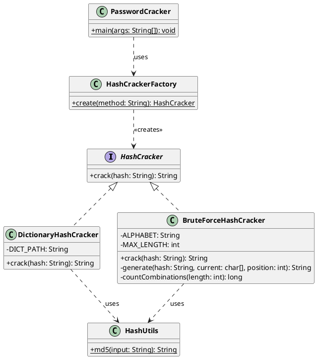
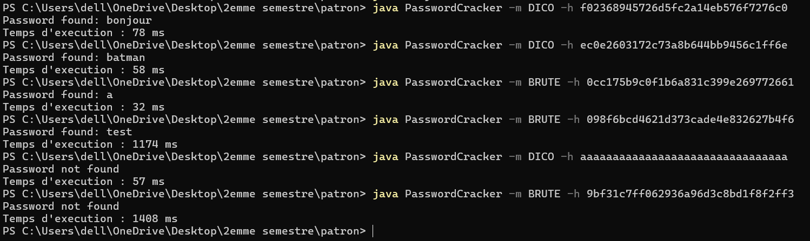

# PasswordCracker v1

## 1. Introduction

PasswordCracker est un outil en ligne de commande développé en Java permettant de retrouver un mot de passe à partir de son empreinte MD5. Ce mini-projet met en œuvre le patron de conception **Simple Factory** dans un contexte de cybersécurité.

---

## 2. Présentation du problème

Les mots de passe sont rarement stockés en clair dans les bases de données. Ils sont transformés via des fonctions de hachage cryptographiques (ici MD5). L'objectif est de retrouver le mot de passe original à partir de son hash, en utilisant deux stratégies :

- **Attaque par dictionnaire** : teste une liste de mots prédéfinis
- **Attaque par force brute** : génère toutes les combinaisons possibles de lettres minuscules jusqu'à 4 caractères

---

## 3. Architecture

Le projet est organisé autour de 5 classes :

| Classe | Rôle |
|---|---|
| `HashCracker` | Interface commune à toutes les stratégies |
| `DictionaryHashCracker` | Stratégie de cassage par dictionnaire |
| `BruteForceHashCracker` | Stratégie de cassage par force brute |
| `HashCrackerFactory` | Fabrique simple — crée la bonne stratégie |
| `HashUtils` | Utilitaire de calcul de hash MD5 |
| `PasswordCracker` | Point d'entrée principal (main) |

Le programme principal ne connaît que l'interface `HashCracker` et la fabrique. Il ne manipule jamais directement les classes concrètes.

---

## 4. Diagramme UML

### Représentation ASCII

```
┌─────────────────────────────────┐
│         <<interface>>           │
│           HashCracker           │
├─────────────────────────────────┤
│ + crack(hash: String): String   │
└─────────────┬───────────────────┘
              │
     ┌────────┴────────┐
     │                 │
     ▼                 ▼
┌──────────────────┐  ┌──────────────────────┐
│DictionaryHash    │  │BruteForceHash        │
│Cracker           │  │Cracker               │
├──────────────────┤  ├──────────────────────┤
│- DICT_PATH:String│  │- ALPHABET: String    │
├──────────────────┤  │- MAX_LENGTH: int     │
│+ crack(hash)     │  ├──────────────────────┤
│  : String        │  │+ crack(hash): String │
└────────┬─────────┘  └──────────┬───────────┘
         │                       │
         └──────────┬────────────┘
                    │ uses
                    ▼
          ┌─────────────────┐
          │    HashUtils    │
          ├─────────────────┤
          │+ md5(input)     │
          │  : String       │
          └─────────────────┘

┌──────────────────────────────────────┐
│         HashCrackerFactory           │
├──────────────────────────────────────┤
│+ create(method: String): HashCracker │  ──creates──▶ HashCracker
└──────────────────────────────────────┘

┌──────────────────────────────────┐
│         PasswordCracker          │
├──────────────────────────────────┤
│+ main(args: String[]): void      │  ──uses──▶ HashCrackerFactory
└──────────────────────────────────┘
```

### Code PlantUML

> Coller ce code sur [plantuml.com](https://www.plantuml.com/plantuml/uml/) pour générer l'image du diagramme.



---

## 5. Usage du patron Simple Factory

La classe `HashCrackerFactory` centralise la création des objets :

```java
public class HashCrackerFactory {
    public static HashCracker create(String method) {
        switch (method.toUpperCase()) {
            case "BRUTE": return new BruteForceHashCracker();
            case "DICO":  return new DictionaryHashCracker();
            default: throw new IllegalArgumentException("Méthode inconnue : " + method);
        }
    }
}
```

Le client (main) l'utilise ainsi :

```java
HashCracker cracker = HashCrackerFactory.create("DICO");
String result = cracker.crack(hash);
```

Avantages constatés :
- La création est centralisée en un seul endroit
- Le `main` est découplé des classes concrètes
- Ajouter une stratégie ne demande qu'une modification dans la fabrique

Limites :
- La fabrique doit être modifiée à chaque nouvelle stratégie → violation du principe Open/Closed
- Ce point sera corrigé dans le mini-projet 2 avec le patron Factory Method

---

## 6. Résultats obtenus

### Compilation

```bash
javac src/*.java -d out
```


Compilation réussie sans erreur.

### Utilisation

```bash
java -cp out PasswordCracker -m DICO  -h <hash_md5>
java -cp out PasswordCracker -m BRUTE -h <hash_md5>
```

### Exemples

```bash
# Hash MD5 de "test" = 098f6bcd4621d373cade4e832627b4f6

java PasswordCracker -m DICO -h 098f6bcd4621d373cade4e832627b4f6
# Tentatives : 7 | Temps : 155 ms
# Password found: test

java PasswordCracker -m BRUTE -h 098f6bcd4621d373cade4e832627b4f6
# Tentatives : ~475254 | Temps : 4456 ms
# Password found: test

java PasswordCracker -m DICO -h <hash_inconnu>
# Password not found
```



> La vidéo de démonstration est disponible  dans les liens suivants : 

> Le depo github suivant : https://github.com/BorutoNiang/password-cracker
> le liens drive suivant : https://drive.google.com/drive/folders/14LKi-o_hvDOcQjQwHaM4vF5H8EZBOkvC
---

## 7. Difficultés rencontrées

- **Chemin du dictionnaire** : le fichier `dictionary.txt` doit être présent à la racine depuis laquelle la commande `java` est lancée.
- **Sensibilité à la casse du hash** : la comparaison entre le hash calculé et le hash recherché doit se faire indépendamment de la casse (`equalsIgnoreCase`), sous peine de rejeter à tort un mot de passe pourtant correct si le hash fourni en argument contient des majuscules.
- **Performance brute force** : avec 4 caractères et 26 lettres, il y a 26 + 26² + 26³ + 26⁴ = 475 254 combinaisons. Le temps d'exécution reste acceptable (~4s) mais croît exponentiellement avec la longueur.

---

## 8. Conclusion

Ce projet illustre concrètement l'utilité du patron Simple Factory pour découpler la création d'objets de leur utilisation. L'interface `HashCracker` permet le polymorphisme : le programme principal traite toutes les stratégies de manière uniforme. La limite principale — la violation du principe Open/Closed — est inhérente à ce patron et constitue la motivation naturelle pour passer au patron Factory Method dans la version suivante.

---

## Questions de réflexion

**1. Quels avantages apporte la fabrique simple ?**
Elle centralise la logique de création, découple le client des classes concrètes, et facilite la maintenance : un seul endroit à modifier pour changer le comportement de création.

**2. Quels sont ses inconvénients ?**
Chaque ajout de stratégie impose une modification de la fabrique, ce qui viole le principe Open/Closed. La fabrique peut aussi devenir volumineuse si le nombre de stratégies augmente.

**3. Que faut-il modifier lorsqu'une nouvelle stratégie est ajoutée ?**
Créer la nouvelle classe implémentant `HashCracker`, puis ajouter un `case` dans le `switch` de `HashCrackerFactory`.

**4. La fabrique respecte-t-elle le principe Open/Closed ?**
Non. Elle doit être modifiée à chaque extension, alors que le principe exige qu'on puisse étendre sans modifier. Le patron Factory Method résout ce problème.
